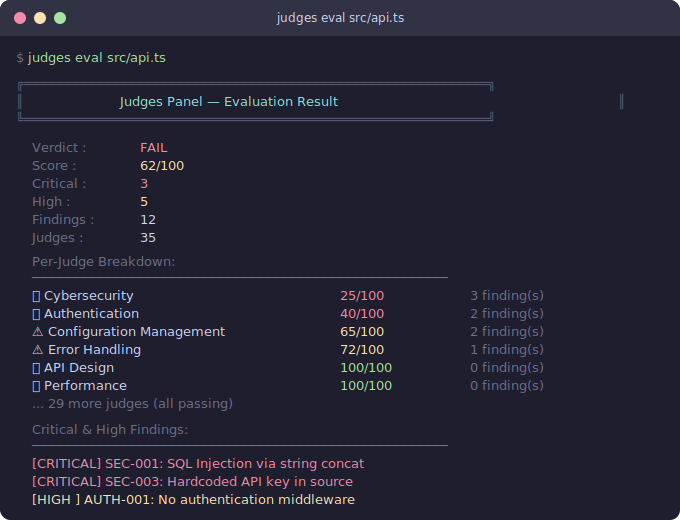

# Judges Panel

An MCP (Model Context Protocol) server that provides a panel of **45 specialized judges** to evaluate AI-generated code — acting as an independent quality gate regardless of which project is being reviewed. Combines **deterministic pattern matching & AST analysis** (instant, offline, zero LLM calls) with **LLM-powered deep-review prompts** that let your AI assistant perform expert-persona analysis across all 45 domains.

**Highlights:**

- Includes an **App Builder Workflow (3-step)** demo for release decisions, plain-language risk summaries, and prioritized fixes — see [Try the Demo](#2-try-the-demo).
- Includes **V2 context-aware evaluation** with policy profiles, evidence calibration, specialty feedback, confidence scoring, and uncertainty reporting.
- Includes **public repository URL reporting** to clone a repo, run the full tribunal, and output a consolidated markdown report.
- **200+ deterministic auto-fix patches** (see `src/patches/index.ts`) plus LLM-powered deep review.

> 🧪 Many commands in `printHelp` are experimental/roadmap. By default, we show GA commands only. Set `JUDGES_SHOW_EXPERIMENTAL=1` to reveal stubs; these may not be wired yet.

[](https://github.com/KevinRabun/judges/actions/workflows/ci.yml)
[](https://www.npmjs.com/package/@kevinrabun/judges)
[](https://www.npmjs.com/package/@kevinrabun/judges)
[](https://opensource.org/licenses/MIT)
[](https://github.com/KevinRabun/judges/actions)

> 🔰 **Packages**
> - **CLI**: `@kevinrabun/judges-cli` → binary `judges` (use `npx @kevinrabun/judges-cli eval --file app.ts`).
> - **MCP/API**: `@kevinrabun/judges` → programmatic API + MCP server (`npm install @kevinrabun/judges`).
> - **VS Code extension**: see [`vscode-extension/`](vscode-extension/README.md).
> - **GitHub Action**: `uses: KevinRabun/judges@main` (see [CI quickstart](#github-action)).

---

## Quickstart

### CLI (one-off)
```bash
# Using the CLI package (recommended)
npx @kevinrabun/judges-cli eval --file src/app.ts

# Show GA commands only (default)
npx @kevinrabun/judges-cli --help

# Show experimental/roadmap commands
echo "JUDGES_SHOW_EXPERIMENTAL=1" >> $GITHUB_ENV
npx @kevinrabun/judges-cli --help

# License scan (supply-chain & license compliance)
npx @kevinrabun/judges-cli license-scan --dir .
```

> **CLI vs API:** If you want to embed Judges in your app (MCP/API), install `@kevinrabun/judges`. For the command-line, use `@kevinrabun/judges-cli` (binary `judges`).

### GitHub Action
```yaml
name: Judges
on: [pull_request, push]
jobs:
  judges:
    runs-on: ubuntu-latest
    steps:
      - uses: actions/checkout@v4
      - uses: KevinRabun/judges@main
        with:
          path: .
          diff-only: true           # evaluate only changed lines in PRs (default true)
          fail-on-findings: true    # fail on critical/high findings
          upload-sarif: true        # upload SARIF to GitHub Code Scanning
```

### Programmatic API (MCP server included)
```bash
npm install @kevinrabun/judges
```
```ts
import { evaluateCode } from "@kevinrabun/judges/api";
const verdict = evaluateCode("const password = 'ProdSecret';", "typescript");
console.log(verdict.overallVerdict, verdict.overallScore);
```

### MCP server

The MCP server runs on stdio and is started by your MCP client (VS Code, Claude Desktop, etc.).
Configure it in your MCP settings (e.g. `mcp.json`):

```json
{
  "servers": {
    "judges": {
      "type": "stdio",
      "command": "npx",
      "args": ["-y", "@kevinrabun/judges"]
    }
  }
}
```

Or run the server directly:
```bash
npx @kevinrabun/judges
# Starts the MCP server on stdio
```

> Config file: `.judgesrc.json` (supports `${ENV_VAR}` substitution via `expandEnvPlaceholders`). See [Configuration](#configuration).

---

## Why Judges?

AI code generators (Copilot, Cursor, Claude, ChatGPT, etc.) write code fast — but they routinely produce **insecure defaults, missing auth, hardcoded secrets, and poor error handling**. Human reviewers catch some of this, but nobody reviews 45 dimensions consistently.

| | ESLint / Biome | SonarQube | Semgrep / CodeQL | **Judges** |
|---|---|---|---|---|
| **Scope** | Style + some bugs | Bugs + code smells | Security patterns | **45 domains**: security, cost, compliance, a11y, API design, cloud, UX, … |
| **AI-generated code focus** | No | No | Partial | **Purpose-built** for AI output failure modes |
| **Setup** | Config per project | Server + scanner | Cloud or local | **One command**: `npx @kevinrabun/judges-cli eval file.ts` |
| **Auto-fix patches** | Some | No | No | **200+ deterministic patches** — instant, offline |
| **Non-technical output** | No | Dashboard | No | **Plain-language findings** with What/Why/Next |
| **MCP native** | No | No | No | **Yes** — works inside Copilot, Claude, Cursor |
| **SARIF output** | No | Yes | Yes | **Yes** — upload to GitHub Code Scanning |
| **Cost** | Free | $$$$ | Free/paid | **Free / MIT** |

**Judges doesn't replace linters** — it covers the dimensions linters don't: authentication strategy, data sovereignty, cost patterns, accessibility, framework-specific anti-patterns, and architectural issues across multiple files.

<p align="center">
  
</p>

---

## Quick Start

> Prereqs: Node.js **>=18** (>=20 recommended), `npx` available. The `judges` CLI binary ships with **@kevinrabun/judges-cli** (preferred) and also works via `npx @kevinrabun/judges`.
>
> Packages:
> - **CLI:** `npm install -g @kevinrabun/judges-cli` (or `npx @kevinrabun/judges-cli ...`)
> - **MCP/API:** `npm install @kevinrabun/judges`

Use `@kevinrabun/judges` for the MCP server and programmatic API. Use `@kevinrabun/judges-cli` when you want the `judges` terminal command.

### Try it now (no clone needed)

```bash
# Install the CLI globally
npm install -g @kevinrabun/judges-cli

# Evaluate any file
judges eval src/app.ts

# Pipe from stdin
cat api.py | judges eval --language python

# Single judge
judges eval --judge cybersecurity server.ts

# SARIF output for CI
judges eval --file app.ts --format sarif > results.sarif

# HTML report with severity filters and dark/light theme
judges eval --file app.ts --format html > report.html

# Fail CI on findings (exit code 1)
judges eval --fail-on-findings src/api.ts

# Suppress known findings via baseline
judges eval --baseline baseline.json src/api.ts

# Use a named preset
judges eval --preset security-only src/api.ts

# Use a config file
judges eval --config .judgesrc.json src/api.ts

# Set a minimum score threshold (exit 1 if below)
judges eval --min-score 80 src/api.ts

# One-line summary for scripts
judges eval --summary src/api.ts

# Agentic skills (orchestrated judge sets)
judges skill ai-code-review --file src/app.ts
judges skill security-review --file src/api.ts --format json
judges skill release-gate --file src/app.ts
judges skills   # list available skills

> Full catalog: [`docs/skills.md`](docs/skills.md)


# List all 45 judges
judges list
```

### Additional CLI Commands

```bash
# Interactive project setup wizard
judges init

# Preview auto-fix patches (dry run)
judges fix src/app.ts

# Apply patches directly
judges fix src/app.ts --apply

# License compliance scan (copyleft/unknown detection)
judges license-scan --format json --risk high

# Watch mode — re-evaluate on file save
judges watch src/

# Project-level report (local directory)
judges report . --format html --output report.html

# Evaluate a unified diff (pipe from git diff)
git diff HEAD~1 | judges diff

# Analyze dependencies for supply-chain risks
judges deps --path . --format json

# Run GitHub App server (zero-config PR reviews)
judges app serve --port 4567

# Run GitHub PR review (gh CLI required)
judges review --pr 123 --repo owner/name --diff-only

# Auto-tune presets and configs
judges tune --dir . --apply

# Create a baseline file to suppress known findings
judges baseline create --file src/api.ts -o baseline.json

# Generate CI template files
judges ci-templates --provider github
judges ci-templates --provider gitlab
judges ci-templates --provider azure
judges ci-templates --provider bitbucket

# Generate per-judge rule documentation
judges docs
judges docs --judge cybersecurity
judges docs --output docs/

# Install shell completions
judges completions bash   # eval "$(judges completions bash)"
judges completions zsh
judges completions fish
judges completions powershell

# Install pre-commit hook
judges hook install

# Uninstall pre-commit hook
judges hook uninstall
```

> 🔎 Tip: The CLI help now defaults to **GA commands only**. To see experimental/roadmap commands, run:
>
> ```bash
> JUDGES_SHOW_EXPERIMENTAL=1 judges --help
> ```

### GitHub App (self-hosted webhook)

Run a zero-config PR reviewer as a GitHub App:

```bash
# Run the webhook server locally
judges app serve --port 4567
```

**Required env vars:**
- `JUDGES_APP_ID` – GitHub App ID
- `JUDGES_PRIVATE_KEY` or `JUDGES_PRIVATE_KEY_PATH` – PEM private key
- `JUDGES_WEBHOOK_SECRET` – signature verification secret

Optional:
- `JUDGES_MIN_SEVERITY` (default: `medium`)
- `JUDGES_MAX_COMMENTS` (default: 25)
- `JUDGES_TEST_DRY_RUN=1` to avoid live network calls during tests

For local testing, you can expose <code>http://localhost:4567/webhook</code> via <code>ngrok http 4567</code> and configure the GitHub App webhook URL accordingly.

### Use in GitHub Actions

Add Judges to your CI pipeline with zero configuration:

```yaml
# .github/workflows/judges.yml
name: Judges Code Review
on: [pull_request]

jobs:
  judges:
    runs-on: ubuntu-latest
    permissions:
      contents: read
      security-events: write  # only if using upload-sarif
    steps:
      - uses: actions/checkout@v4
      - uses: KevinRabun/judges@main
        with:
          path: src/api.ts        # file or directory
          format: text             # text | json | sarif | markdown
          upload-sarif: true       # upload to GitHub Code Scanning
          fail-on-findings: true   # fail CI on critical/high findings
```

**Outputs** available for downstream steps: `verdict`, `score`, `findings`, `critical`, `high`, `sarif-file`.

### Use with Docker (no Node.js required)

```bash
# Build the image
docker build -t judges .

# Evaluate a local file
docker run --rm -v $(pwd):/code judges eval --file /code/app.ts

# Pipe from stdin
cat api.py | docker run --rm -i judges eval --language python

# List judges
docker run --rm judges list
```

### Or use as an MCP server

### 1. Install and Build

```bash
git clone https://github.com/KevinRabun/judges.git
cd judges
npm install
npm run build
```

### 2. Try the Demo

Run the included demo to see all 45 judges evaluate a purposely flawed API server:

```bash
npm run demo
```

This evaluates [`examples/sample-vulnerable-api.ts`](examples/sample-vulnerable-api.ts) — a file intentionally packed with security holes, performance anti-patterns, and code quality issues — and prints a full verdict with per-judge scores and findings.

The demo now also includes an **App Builder Workflow (3-step)** section. In a single run, you get both tribunal output and workflow output:
- Release decision (`Ship now` / `Ship with caution` / `Do not ship`)
- Plain-language summaries of top risks
- Prioritized remediation tasks and AI-fixable `P0/P1` items

**Sample workflow output (truncated):**

```text
╔══════════════════════════════════════════════════════════════╗
║             App Builder Workflow Demo (3-Step)             ║
╚══════════════════════════════════════════════════════════════╝

  Decision       : Do not ship
  Verdict        : FAIL (47/100)
  Risk Counts    : Critical 24 | High 27 | Medium 55

  Step 2 — Plain-Language Findings:
  - [CRITICAL] DATA-001: Hardcoded password detected
      What: ...
      Why : ...
      Next: ...

  Step 3 — Prioritized Tasks:
  - P0 | DEVELOPER | Effort L | DATA-001
      Task: ...
      Done: ...

  AI-Fixable Now (P0/P1):
  - P0 DATA-001: ...
```

**Sample tribunal output (truncated):**

```
╔══════════════════════════════════════════════════════════════╗
║           Judges Panel — Full Tribunal Demo                 ║
╚══════════════════════════════════════════════════════════════╝

  Overall Verdict : FAIL
  Overall Score   : 43/100
  Critical Issues : 15
  High Issues     : 17
  Total Findings  : 83
  Judges Run      : 33

  Per-Judge Breakdown:
  ────────────────────────────────────────────────────────────────
  ❌ Judge Data Security              0/100    7 finding(s)
  ❌ Judge Cybersecurity              0/100    7 finding(s)
  ❌ Judge Cost Effectiveness        52/100    5 finding(s)
  ⚠️  Judge Scalability              65/100    4 finding(s)
  ❌ Judge Cloud Readiness           61/100    4 finding(s)
  ❌ Judge Software Practices        45/100    6 finding(s)
  ❌ Judge Accessibility              0/100    8 finding(s)
  ❌ Judge API Design                 0/100    9 finding(s)
  ❌ Judge Reliability               54/100    3 finding(s)
  ❌ Judge Observability             45/100    5 finding(s)
  ❌ Judge Performance               27/100    5 finding(s)
  ❌ Judge Compliance                 0/100    4 finding(s)
  ⚠️  Judge Testing                  90/100    1 finding(s)
  ⚠️  Judge Documentation            70/100    4 finding(s)
  ⚠️  Judge Internationalization     65/100    4 finding(s)
  ⚠️  Judge Dependency Health        90/100    1 finding(s)
  ❌ Judge Concurrency               44/100    4 finding(s)
  ❌ Judge Ethics & Bias             65/100    2 finding(s)
  ❌ Judge Maintainability           52/100    4 finding(s)
  ❌ Judge Error Handling            27/100    3 finding(s)
  ❌ Judge Authentication             0/100    4 finding(s)
  ❌ Judge Database                   0/100    5 finding(s)
  ❌ Judge Caching                   62/100    3 finding(s)
  ❌ Judge Configuration Mgmt         0/100    3 finding(s)
  ⚠️  Judge Backwards Compat         80/100    2 finding(s)
  ⚠️  Judge Portability              72/100    2 finding(s)
  ❌ Judge UX                        52/100    4 finding(s)
  ❌ Judge Logging Privacy            0/100    4 finding(s)
  ❌ Judge Rate Limiting             27/100    4 finding(s)
  ⚠️  Judge CI/CD                    80/100    2 finding(s)
```

### 3. Run the Tests

```bash
npm test
```

Runs automated tests covering all judges, AST parsers, markdown formatters, and edge cases.

### 4. Connect to Your Editor

#### VS Code (recommended — zero config)

Install the **[Judges Panel](https://marketplace.visualstudio.com/items?itemName=kevinrabun.judges-panel)** extension from the Marketplace. It provides:

- **Inline diagnostics & quick-fixes** on every file save
- **`@judges` chat participant** — type `@judges` in Copilot Chat, or just ask for a "judges panel review" and Copilot routes automatically
- **Auto-configured MCP server** — all 45 expert-persona prompts available to Copilot with zero setup

```bash
code --install-extension kevinrabun.judges-panel
```

#### VS Code — manual MCP config

If you prefer explicit workspace config (or want teammates without the extension to benefit), create `.vscode/mcp.json`:

```json
{
  "servers": {
    "judges": {
      "command": "npx",
      "args": ["-y", "@kevinrabun/judges"]
    }
  }
}
```

#### Claude Desktop

Add to `claude_desktop_config.json`:

```json
{
  "mcpServers": {
    "judges": {
      "command": "npx",
      "args": ["-y", "@kevinrabun/judges"]
    }
  }
}
```

#### Cursor / other MCP clients

Use the same `npx` command for any MCP-compatible client:

```json
{
  "command": "npx",
  "args": ["-y", "@kevinrabun/judges"]
}
```

### 5. Use Judges in GitHub Copilot PR Reviews

Yes — users can include Judges as part of GitHub-based review workflows, with one important caveat:

- The hosted `copilot-pull-request-reviewer` on GitHub does not currently let you directly attach arbitrary local MCP servers the same way VS Code does.
- The practical pattern is to run Judges in CI on each PR, publish a report/check, and have Copilot + human reviewers use that output during review.

#### Option A (recommended): PR workflow check + report artifact

Create `.github/workflows/judges-pr-review.yml`:

```yaml
name: Judges PR Review

on:
  pull_request:
    types: [opened, synchronize, reopened]

jobs:
  judges:
    runs-on: ubuntu-latest
    permissions:
      contents: read
      pull-requests: write

    steps:
      - name: Checkout
        uses: actions/checkout@v4

      - name: Setup Node
        uses: actions/setup-node@v4
        with:
          node-version: 20
          cache: npm

      - name: Install
        run: npm ci

      - name: Generate Judges report
        run: |
          npx tsx -e "import { generateRepoReportFromLocalPath } from './src/reports/public-repo-report.ts';
          const result = generateRepoReportFromLocalPath({
            repoPath: process.cwd(),
            outputPath: 'judges-pr-report.md',
            maxFiles: 600,
            maxFindingsInReport: 150,
          });
          console.log('Overall:', result.overallVerdict, result.averageScore);"

      - name: Upload report artifact
        uses: actions/upload-artifact@v4
        with:
          name: judges-pr-report
          path: judges-pr-report.md
```

This gives every PR a reproducible Judges output your team (and Copilot) can reference.

#### Option B: Add Copilot custom instructions in-repo

Add `.github/instructions/judges.instructions.md` with guidance such as:

```markdown
When reviewing pull requests:
1. Read the latest Judges report artifact/check output first.
2. Prioritize CRITICAL and HIGH findings in remediation guidance.
3. If findings conflict, defer to security/compliance-related Judges.
4. Include rule IDs (e.g., DATA-001, CYBER-004) in suggested fixes.
```

This helps keep Copilot feedback aligned with Judges findings.

---

## CLI Reference

All commands support `--help` for usage details.

### `judges eval`

Evaluate a file with all 45 judges or a single judge.

| Flag | Description |
|------|-------------|
| `--file <path>` / positional | File to evaluate |
| `--judge <id>` / `-j <id>` | Single judge mode |
| `--language <lang>` / `-l <lang>` | Language hint (auto-detected from extension) |
| `--format <fmt>` / `-f <fmt>` | Output format: `text`, `json`, `sarif`, `markdown`, `html`, `pdf`, `junit`, `codeclimate`, `github-actions` |
| `--output <path>` / `-o <path>` | Write output to file |
| `--fail-on-findings` | Exit with code 1 if verdict is FAIL |
| `--baseline <path>` / `-b <path>` | JSON baseline file — suppress known findings |
| `--summary` | Print a single summary line (ideal for scripts) |
| `--config <path>` | Load a `.judgesrc` / `.judgesrc.json` config file |
| `--preset <name>` | Use a named preset (see [Named Presets](#named-presets) for all 18 options) |
| `--min-score <n>` | Exit with code 1 if overall score is below this threshold |
| `--verbose` | Print timing and debug information |
| `--quiet` | Suppress non-essential output |
| `--no-color` | Disable ANSI colors |

### `judges init`

Interactive wizard that generates project configuration:
- `.judgesrc.json` — rule customization, disabled judges, severity thresholds
- `.github/workflows/judges.yml` — GitHub Actions CI workflow
- `.gitlab-ci.judges.yml` — GitLab CI pipeline (optional)
- `azure-pipelines.judges.yml` — Azure Pipelines (optional)

### `judges fix`

Preview or apply auto-fix patches from deterministic findings.

| Flag | Description |
|------|-------------|
| positional | File to fix |
| `--apply` | Write patches to disk (default: dry run) |
| `--judge <id>` | Limit to a single judge's findings |

### `judges watch`

Continuously re-evaluate files on save.

| Flag | Description |
|------|-------------|
| positional | File or directory to watch (default: `.`) |
| `--judge <id>` | Single judge mode |
| `--fail-on-findings` | Exit non-zero if any evaluation fails |

### `judges report`

Run a full project-level tribunal on a local directory.

| Flag | Description |
|------|-------------|
| positional | Directory path (default: `.`) |
| `--format <fmt>` | Output format: `text`, `json`, `html`, `markdown` |
| `--output <path>` | Write report to file |
| `--max-files <n>` | Maximum files to analyze (default: 600) |
| `--max-file-bytes <n>` | Skip files larger than this (default: 300000) |

### `judges hook`

Manage a Git pre-commit hook that runs Judges on staged files.

```bash
judges hook install    # add pre-commit hook
judges hook uninstall  # remove pre-commit hook
```

Detects Husky (`.husky/pre-commit`) and falls back to `.git/hooks/pre-commit`. Uses marker-based injection so it won't clobber existing hooks.

### `judges diff`

Evaluate only the changed lines from a unified diff (e.g., `git diff` output).

| Flag | Description |
|------|-------------|
| `--file <path>` | Read diff from file instead of stdin |
| `--format <fmt>` | Output format: `text`, `json`, `sarif`, `junit`, `codeclimate` |
| `--output <path>` | Write output to file |

```bash
git diff HEAD~1 | judges diff
judges diff --file changes.patch --format sarif
```

### `judges deps`

Analyze project dependencies for supply-chain risks.

| Flag | Description |
|------|-------------|
| `--path <dir>` | Project root to scan (default: `.`) |
| `--format <fmt>` | Output format: `text`, `json` |

```bash
judges deps --path .
judges deps --path ./backend --format json
```

### `judges baseline`

Create a baseline file to suppress known findings in future evaluations.

```bash
judges baseline create --file src/api.ts
judges baseline create --file src/api.ts -o .judges-baseline.json
```

### `judges ci-templates`

Generate CI/CD configuration templates for popular providers.

```bash
judges ci-templates --provider github   # .github/workflows/judges.yml
judges ci-templates --provider gitlab   # .gitlab-ci.judges.yml
judges ci-templates --provider azure    # azure-pipelines.judges.yml
judges ci-templates --provider bitbucket # bitbucket-pipelines.yml (snippet)
```

### `judges docs`

Generate per-judge rule documentation in Markdown.

| Flag | Description |
|------|-------------|
| `--judge <id>` | Generate docs for a single judge |
| `--output <dir>` | Write individual `.md` files per judge |

```bash
judges docs                          # all judges to stdout
judges docs --judge cybersecurity    # single judge
judges docs --output docs/judges/    # write files to directory
```

### `judges completions`

Generate shell completion scripts.

```bash
eval "$(judges completions bash)"        # Bash
eval "$(judges completions zsh)"         # Zsh
judges completions fish | source         # Fish
judges completions powershell            # PowerShell (Register-ArgumentCompleter)
```

### Named Presets

Use `--preset` to apply pre-configured evaluation settings:

| Preset | Description |
|--------|-------------|
| `strict` | All severities, all judges — maximum thoroughness |
| `lenient` | Only high and critical findings — fast and focused |
| `security-only` | Security-focused — disables non-security judges (cost, scalability, docs, a11y, i18n, UX, etc.) |
| `startup` | Skip compliance, sovereignty, i18n judges — move fast |
| `compliance` | Only compliance, data-sovereignty, authentication — regulatory focus |
| `performance` | Only performance, scalability, caching, cost-effectiveness |
| `react` | Tuned for React/Next.js apps — enables accessibility, XSS protection |
| `express` | Tuned for Express.js APIs — middleware security, auth, CORS, rate limiting |
| `fastapi` | Tuned for Python FastAPI — input validation, async patterns, API security |
| `django` | Tuned for Django apps — template security, ORM misuse, CSRF |
| `spring-boot` | Tuned for Java Spring Boot — injection, configuration, actuator security |
| `rails` | Tuned for Ruby on Rails — mass assignment, CSRF, SQL injection |
| `nextjs` | Tuned for Next.js — server/client security, API routes, SSR/ISR |
| `terraform` | Tuned for Terraform/OpenTofu IaC — infrastructure security, compliance |
| `kubernetes` | Tuned for K8s manifests — security contexts, RBAC, resource limits |
| `onboarding` | Smart defaults for first-time adoption — suppresses noisy rules |
| `fintech` | Financial services — PCI DSS, cryptography, authentication, audit |
| `healthtech` | Healthcare — HIPAA compliance, data sovereignty, encryption, audit trails |
| `saas` | Multi-tenant SaaS — tenant isolation, rate limiting, scalability |
| `government` | Government/public sector — compliance, sovereignty, authentication |

```bash
judges eval --preset security-only src/api.ts
judges eval --preset strict --format sarif src/app.ts > results.sarif
```

### CI Output Formats

#### JUnit XML

Generate JUnit XML for Jenkins, Azure DevOps, GitHub Actions, or GitLab test result viewers:

```bash
judges eval --format junit src/api.ts > results.xml
```

Each judge maps to a `<testsuite>`, each finding becomes a `<testcase>` with `<failure>` for critical/high severity.

#### CodeClimate / GitLab Code Quality

Generate CodeClimate JSON for GitLab Code Quality or similar tools:

```bash
judges eval --format codeclimate src/api.ts > codequality.json
```

#### Score Badges

Generate SVG or text badges for your README:

```typescript
import { generateBadgeSvg, generateBadgeText } from "@kevinrabun/judges/badge";

const svg = generateBadgeSvg(85);          // shields.io-style SVG
const text = generateBadgeText(85);        // "✓ judges 85/100"
const svg2 = generateBadgeSvg(75, "quality"); // custom label
```

---

## The Judge Panel

<!-- JUDGES_TABLE_START -->
| Judge | Domain | Rule Prefix | What It Evaluates |
|-------|--------|-------------|-------------------|
| **Data Security** | Data Security & Privacy | `DATA-` | Encryption, PII handling, secrets management, access controls |
| **Cybersecurity** | Cybersecurity & Threat Defense | `CYBER-` | Injection attacks, XSS, CSRF, auth flaws, OWASP Top 10 |
| **Cost Effectiveness** | Cost Optimization & Resource Efficiency | `COST-` | Algorithm efficiency, N+1 queries, memory waste, caching strategy |
| **Scalability** | Scalability & Performance | `SCALE-` | Statelessness, horizontal scaling, concurrency, bottlenecks |
| **Cloud Readiness** | Cloud-Native Architecture & DevOps | `CLOUD-` | 12-Factor compliance, containerization, graceful shutdown, IaC |
| **Software Practices** | Software Engineering Best Practices & Secure SDLC | `SWDEV-` | SOLID principles, type safety, error handling, input validation |
| **Accessibility** | Accessibility (a11y) | `A11Y-` | WCAG compliance, screen reader support, keyboard navigation, ARIA |
| **API Design** | API Design & Contracts | `API-` | REST conventions, versioning, pagination, error responses |
| **Reliability** | Reliability & Resilience | `REL-` | Error handling, timeouts, retries, circuit breakers |
| **Observability** | Monitoring & Diagnostics | `OBS-` | Structured logging, health checks, metrics, tracing |
| **Performance** | Runtime Performance | `PERF-` | N+1 queries, sync I/O, caching, memory leaks |
| **Compliance** | Regulatory & License Compliance | `COMP-` | GDPR/CCPA, PII protection, consent, data retention, audit trails |
| **Data Sovereignty** | Data, Technological & Operational Sovereignty | `SOV-` | Data residency, cross-border transfers, vendor key management, AI model portability, identity federation, circuit breakers, audit trails, data export |
| **Testing** | Test Quality & Coverage | `TEST-` | Test coverage, assertions, test isolation, naming |
| **Documentation** | Documentation & Developer Experience | `DOC-` | JSDoc/docstrings, magic numbers, TODOs, code comments |
| **Internationalization** | i18n & Localization | `I18N-` | Hardcoded strings, locale handling, currency formatting |
| **Dependency Health** | Supply Chain & Dependencies | `DEPS-` | Version pinning, deprecated packages, supply chain |
| **Concurrency** | Concurrency & Thread Safety | `CONC-` | Race conditions, unbounded parallelism, missing await |
| **Ethics & Bias** | AI/ML Fairness & Ethics | `ETHICS-` | Demographic logic, dark patterns, inclusive language |
| **Maintainability** | Code Maintainability & Technical Debt | `MAINT-` | Any types, magic numbers, deep nesting, dead code, file length |
| **Error Handling** | Error Handling & Fault Tolerance | `ERR-` | Empty catch blocks, missing error handlers, swallowed errors |
| **Authentication** | Authentication & Authorization | `AUTH-` | Hardcoded creds, missing auth middleware, token in query params |
| **Database** | Database Design & Query Efficiency | `DB-` | SQL injection, N+1 queries, connection pooling, transactions |
| **Caching** | Caching Strategy & Data Freshness | `CACHE-` | Unbounded caches, missing TTL, no HTTP cache headers |
| **Configuration Management** | Configuration & Secrets Management | `CFG-` | Hardcoded secrets, missing env vars, config validation |
| **Backwards Compatibility** | Backwards Compatibility & Versioning | `COMPAT-` | API versioning, breaking changes, response consistency |
| **Portability** | Platform Portability & Vendor Independence | `PORTA-` | OS-specific paths, vendor lock-in, hardcoded hosts |
| **UX** | User Experience & Interface Quality | `UX-` | Loading states, error messages, pagination, destructive actions |
| **Logging Privacy** | Logging Privacy & Data Redaction | `LOGPRIV-` | PII in logs, token logging, structured logging, redaction |
| **Rate Limiting** | Rate Limiting & Throttling | `RATE-` | Missing rate limits, unbounded queries, backoff strategy |
| **CI/CD** | CI/CD Pipeline & Deployment Safety | `CICD-` | Test infrastructure, lint config, Docker tags, build scripts |
| **Code Structure** | Structural Analysis | `STRUCT-` | Cyclomatic complexity, nesting depth, function length, dead code, type safety |
| **Agent Instructions** | Agent Instruction Markdown Quality & Safety | `AGENT-` | Instruction hierarchy, conflict detection, unsafe overrides, scope, validation, policy guidance |
| **AI Code Safety** | AI-Generated Code Quality & Security | `AICS-` | Prompt injection, insecure LLM output handling, debug defaults, missing validation, unsafe deserialization of AI responses |
| **Framework Safety** | Framework-Specific Security & Best Practices | `FW-` | React hooks ordering, Express middleware chains, Next.js SSR/SSG pitfalls, Angular/Vue lifecycle patterns, Django/Flask/FastAPI safety, Spring Boot security, ASP.NET Core auth & CORS, Go Gin/Echo/Fiber patterns |
| **IaC Security** | Infrastructure as Code | `IAC-` | Terraform, Bicep, ARM template misconfigurations, hardcoded secrets, missing encryption, overly permissive network/IAM rules |
| **Security** | General Security Posture | `SEC-` | Holistic security assessment — insecure data flows, weak cryptography, unsafe deserialization |
| **Hallucination Detection** | AI-Hallucinated API & Import Validation | `HALLU-` | Detects hallucinated APIs, fabricated imports, and non-existent modules from AI code generators |
| **Intent Alignment** | Code–Comment Alignment & Stub Detection | `INTENT-` | Detects mismatches between stated intent and implementation, placeholder stubs, TODO-only functions |
| **API Contract Conformance** | API Design & REST Best Practices | `API-` | API endpoint input validation, REST conformance, request/response contract consistency |
| **Multi-Turn Coherence** | Code Coherence & Consistency | `COH-` | Self-contradicting patterns, duplicate definitions, dead code, inconsistent naming |
| **Model Fingerprint Detection** | AI Code Provenance & Model Attribution | `MFPR-` | Detects stylistic fingerprints characteristic of specific AI code generators |
| **Over-Engineering** | Simplicity & Pragmatism | `OVER-` | Unnecessary abstractions, wrapper-mania, premature generalization, over-complex patterns |
| **Logic Review** | Semantic Correctness & Logic Integrity | `LOGIC-` | Inverted conditions, dead code, name-body mismatch, off-by-one, incomplete control flow |
| **False-Positive Review** | False Positive Detection & Finding Accuracy | `FPR-` | Meta-judge reviewing pattern-based findings for false positives: string literal context, comment/docstring matches, test scaffolding, IaC template gating |
<!-- JUDGES_TABLE_END -->

---

## How It Works

The tribunal operates in three layers:

1. **Pattern-Based Analysis** — All tools (`evaluate_code`, `evaluate_code_single_judge`, `evaluate_project`, `evaluate_diff`) perform heuristic analysis using regex pattern matching to catch common anti-patterns. This layer is instant, deterministic, and runs entirely offline with zero external API calls.

2. **AST-Based Structural Analysis** — The Code Structure judge (`STRUCT-*` rules) uses real Abstract Syntax Tree parsing to measure cyclomatic complexity, nesting depth, function length, parameter count, dead code, and type safety with precision that regex cannot achieve. All supported languages — **TypeScript, JavaScript, Python, Rust, Go, Java, C#, and C++** — are parsed via **tree-sitter WASM grammars** (real syntax trees compiled to WebAssembly, in-process, zero native dependencies). A scope-tracking structural parser is kept as a fallback when WASM grammars are unavailable. No external AST server required.

3. **LLM-Powered Deep Analysis (Prompts)** — The server exposes MCP prompts (e.g., `judge-data-security`, `full-tribunal`) that provide each judge's expert persona as a system prompt. When used by an LLM-based client (Copilot, Claude, Cursor, etc.), the host LLM performs deeper, context-aware probabilistic analysis beyond what static patterns can detect. This is where the `systemPrompt` on each judge comes alive — Judges itself makes no LLM calls, but it provides the expert criteria so your AI assistant can act as 45 specialized reviewers.

---

## Composable by Design

Judges Panel is a **dual-layer** review system: instant **deterministic tools** (offline, no API keys) for pattern and AST analysis, plus **45 expert-persona MCP prompts** that unlock LLM-powered deep analysis when connected to an AI client. It does not try to be a CVE scanner or a linter. Those capabilities belong in dedicated MCP servers that an AI agent can orchestrate alongside Judges.

### Built-in AST Analysis (v2.0.0+)

Unlike earlier versions that recommended a separate AST MCP server, Judges Panel now includes **real AST-based structural analysis** out of the box:

- **TypeScript, JavaScript, Python, Rust, Go, Java, C#, C++** — All parsed with a **unified tree-sitter WASM engine** for full syntax-tree analysis (functions, complexity, nesting, dead code, type safety). Falls back to a scope-tracking structural parser when WASM grammars are unavailable

The Code Structure judge (`STRUCT-*`) uses these parsers to accurately measure:

| Rule | Metric | Threshold |
|------|--------|-----------|
| `STRUCT-001` | Cyclomatic complexity | > 10 per function (high) |
| `STRUCT-002` | Nesting depth | > 4 levels (medium) |
| `STRUCT-003` | Function length | > 50 lines (medium) |
| `STRUCT-004` | Parameter count | > 5 parameters (medium) |
| `STRUCT-005` | Dead code | Unreachable statements (low) |
| `STRUCT-006` | Weak types | `any`, `dynamic`, `Object`, `interface{}`, `unsafe` (medium) |
| `STRUCT-007` | File complexity | > 40 total cyclomatic complexity (high) |
| `STRUCT-008` | Extreme complexity | > 20 per function (critical) |
| `STRUCT-009` | Extreme parameters | > 8 parameters (high) |
| `STRUCT-010` | Extreme function length | > 150 lines (high) |

### Recommended MCP Stack

When your AI coding assistant connects to multiple MCP servers, each one contributes its specialty:

```
┌─────────────────────────────────────────────────────────┐
│                   AI Coding Assistant                   │
│              (Claude, Copilot, Cursor, etc.)            │
└──────┬──────────────────┬──────────┬───────────────────┘
       │                  │          │
       ▼                  ▼          ▼
  ┌──────────────┐  ┌────────┐  ┌────────┐
  │   Judges     │  │  CVE / │  │ Linter │
  │   Panel      │  │  SBOM  │  │ Server │
  │ ─────────────│  └────────┘  └────────┘
  │ 36 Heuristic │   Vuln DB     Style &
  │   judges     │   scanning    correctness
  │ + AST judge  │
  └──────────────┘
   Patterns +
   structural
   analysis
```

| Layer | What It Does | Example Servers |
|-------|-------------|-----------------|
| **Judges Panel** | 45-judge quality gate — security patterns, AST analysis, cost, scalability, a11y, compliance, sovereignty, ethics, dependency health, agent instruction governance, AI code safety, framework safety | This server |
| **CVE / SBOM** | Vulnerability scanning against live databases — known CVEs, license risks, supply chain | OSV, Snyk, Trivy, Grype MCP servers |
| **Linting** | Language-specific style and correctness rules | ESLint, Ruff, Clippy MCP servers |
| **Runtime Profiling** | Memory, CPU, latency measurement on running code | Custom profiling MCP servers |

### What This Means in Practice

When you ask your AI assistant *"Is this code production-ready?"*, the agent can:

1. **Judges Panel** → Scan for hardcoded secrets, missing error handling, N+1 queries, accessibility gaps, compliance issues, **plus** analyze cyclomatic complexity, detect dead code, and flag deeply nested functions via AST
2. **CVE Server** → Check every dependency in `package.json` against known vulnerabilities
3. **Linter Server** → Enforce team style rules, catch language-specific gotchas

Each server returns structured findings. The AI synthesizes everything into a single, actionable review — no single server needs to do it all.

---

## MCP Tools

### `evaluate_v2`
Run a **V2 context-aware tribunal evaluation** designed to raise feedback quality toward lead engineer/architect-level review:

- Policy profile calibration (`default`, `startup`, `regulated`, `healthcare`, `fintech`, `public-sector`)
- Context ingestion (architecture notes, constraints, standards, known risks, data-boundary model)
- Runtime evidence hooks (tests, coverage, latency, error rate, vulnerability counts)
- Specialty feedback aggregation by judge/domain
- Confidence scoring and explicit uncertainty reporting

Supports:
- **Code mode**: `code` + `language`
- **Project mode**: `files[]`

| Parameter | Type | Required | Description |
|-----------|------|----------|-------------|
| `code` | string | conditional | Source code for single-file mode |
| `language` | string | conditional | Programming language for single-file mode |
| `files` | array | conditional | `{ path, content, language }[]` for project mode |
| `context` | string | no | High-level review context |
| `includeAstFindings` | boolean | no | Include AST/code-structure findings (default: true) |
| `minConfidence` | number | no | Minimum finding confidence to include (0-1, default: 0) |
| `policyProfile` | enum | no | `default`, `startup`, `regulated`, `healthcare`, `fintech`, `public-sector` |
| `evaluationContext` | object | no | Structured architecture/constraint context |
| `evidence` | object | no | Runtime/operational evidence for confidence calibration |

### `evaluate_app_builder_flow`
Run a **3-step app-builder workflow** for technical and non-technical stakeholders:

1. Tribunal review (code/project/diff)
2. Plain-language translation of top risks
3. Prioritized remediation tasks with AI-fixable P0/P1 extraction

Supports:
- **Code mode**: `code` + `language`
- **Project mode**: `files[]`
- **Diff mode**: `code` + `language` + `changedLines[]`

| Parameter | Type | Required | Description |
|-----------|------|----------|-------------|
| `code` | string | conditional | Full source content (code/diff mode) |
| `language` | string | conditional | Programming language (code/diff mode) |
| `files` | array | conditional | `{ path, content, language }[]` for project mode |
| `changedLines` | number[] | no | 1-based changed lines for diff mode |
| `context` | string | no | Optional business/technical context |
| `maxFindings` | number | no | Max translated top findings (default: 10) |
| `maxTasks` | number | no | Max generated tasks (default: 20) |
| `includeAstFindings` | boolean | no | Include AST/code-structure findings (default: true) |
| `minConfidence` | number | no | Minimum finding confidence to include (0-1, default: 0) |

### `evaluate_public_repo_report`
Clone a **public repository URL**, run the full judges panel across eligible source files, and generate a consolidated markdown report.

| Parameter | Type | Required | Description |
|-----------|------|----------|-------------|
| `repoUrl` | string | yes | Public repository URL (`https://...`) |
| `branch` | string | no | Optional branch name |
| `outputPath` | string | no | Optional path to write report markdown |
| `maxFiles` | number | no | Max files analyzed (default: 600) |
| `maxFileBytes` | number | no | Max file size in bytes (default: 300000) |
| `maxFindingsInReport` | number | no | Max detailed findings in output (default: 150) |
| `credentialMode` | string | no | Credential detection mode: `standard` (default) or `strict` |
| `includeAstFindings` | boolean | no | Include AST/code-structure findings (default: true) |
| `minConfidence` | number | no | Minimum finding confidence to include (0-1, default: 0) |
| `enableMustFixGate` | boolean | no | Enable must-fix gate summary for high-confidence dangerous findings (default: false) |
| `mustFixMinConfidence` | number | no | Confidence threshold for must-fix gate triggers (0-1, default: 0.85) |
| `mustFixDangerousRulePrefixes` | string[] | no | Optional dangerous rule prefixes for gate matching (e.g., `AUTH`, `CYBER`, `DATA`) |
| `keepClone` | boolean | no | Keep cloned repo on disk for inspection |

**Quick examples**

Generate a report from CLI:

```bash
npm run report:public-repo -- --repoUrl https://github.com/microsoft/vscode --output reports/vscode-judges-report.md

# stricter credential-signal mode (optional)
npm run report:public-repo -- --repoUrl https://github.com/openclaw/openclaw --credentialMode strict --output reports/openclaw-judges-report-strict.md

# judge findings only (exclude AST/code-structure findings)
npm run report:public-repo -- --repoUrl https://github.com/openclaw/openclaw --includeAstFindings false --output reports/openclaw-judges-report-no-ast.md

# show only findings at 80%+ confidence
npm run report:public-repo -- --repoUrl https://github.com/openclaw/openclaw --minConfidence 0.8 --output reports/openclaw-judges-report-high-confidence.md

# include must-fix gate summary in the generated report
npm run report:public-repo -- --repoUrl https://github.com/openclaw/openclaw --enableMustFixGate true --mustFixMinConfidence 0.9 --mustFixDangerousPrefix AUTH --mustFixDangerousPrefix CYBER --output reports/openclaw-judges-report-mustfix.md

# opinionated quick-start mode (recommended first run)
npm run report:quickstart -- --repoUrl https://github.com/openclaw/openclaw --output reports/openclaw-quickstart.md
```

Call from MCP client:

```json
{
  "tool": "evaluate_public_repo_report",
  "arguments": {
    "repoUrl": "https://github.com/microsoft/vscode",
    "branch": "main",
    "maxFiles": 400,
    "maxFindingsInReport": 120,
    "credentialMode": "strict",
    "includeAstFindings": false,
    "minConfidence": 0.8,
    "enableMustFixGate": true,
    "mustFixMinConfidence": 0.9,
    "mustFixDangerousRulePrefixes": ["AUTH", "CYBER", "DATA"],
    "outputPath": "reports/vscode-judges-report.md"
  }
}
```

Typical response summary includes:
- overall verdict and average score
- analyzed file count and total findings
- per-judge score table
- highest-risk findings and lowest-scoring files

Sample report snippet:

```text
# Public Repository Full Judges Report

Generated from https://github.com/microsoft/vscode on 2026-02-21T12:00:00.000Z.

## Executive Summary
- Overall verdict: WARNING
- Average file score: 78/100
- Total findings: 412 (critical 3, high 29, medium 114, low 185, info 81)
```

### `get_judges`
List all available judges with their domains and descriptions.

### `evaluate_code`
Submit code to the **full judges panel**. all 45 judges evaluate independently and return a combined verdict.

| Parameter | Type | Required | Description |
|-----------|------|----------|-------------|
| `code` | string | yes | The source code to evaluate |
| `language` | string | yes | Programming language (e.g., `typescript`, `python`) |
| `context` | string | no | Additional context about the code |
| `includeAstFindings` | boolean | no | Include AST/code-structure findings (default: true) |
| `minConfidence` | number | no | Minimum finding confidence to include (0-1, default: 0) |
| `config` | object | no | Inline configuration (see [Configuration](#configuration)) |

### `evaluate_code_single_judge`
Submit code to a **specific judge** for targeted review.

| Parameter | Type | Required | Description |
|-----------|------|----------|-------------|
| `code` | string | yes | The source code to evaluate |
| `language` | string | yes | Programming language |
| `judgeId` | string | yes | See [judge IDs](#judge-ids) below |
| `context` | string | no | Additional context |
| `minConfidence` | number | no | Minimum finding confidence to include (0-1, default: 0) |
| `config` | object | no | Inline configuration (see [Configuration](#configuration)) |

### `evaluate_project`
Submit multiple files for **project-level analysis**. all 45 judges evaluate each file, plus cross-file architectural analysis detects code duplication, inconsistent error handling, and dependency cycles.

| Parameter | Type | Required | Description |
|-----------|------|----------|-------------|
| `files` | array | yes | Array of `{ path, content, language }` objects |
| `context` | string | no | Optional project context |
| `includeAstFindings` | boolean | no | Include AST/code-structure findings (default: true) |
| `minConfidence` | number | no | Minimum finding confidence to include (0-1, default: 0) |
| `config` | object | no | Inline configuration (see [Configuration](#configuration)) |

### `evaluate_diff`
Evaluate only the **changed lines** in a code diff. Runs all 45 judges on the full file but filters findings to lines you specify. Ideal for PR reviews and incremental analysis.

| Parameter | Type | Required | Description |
|-----------|------|----------|-------------|
| `code` | string | yes | The full file content (post-change) |
| `language` | string | yes | Programming language |
| `changedLines` | number[] | yes | 1-based line numbers that were changed |
| `context` | string | no | Optional context about the change |
| `includeAstFindings` | boolean | no | Include AST/code-structure findings (default: true) |
| `minConfidence` | number | no | Minimum finding confidence to include (0-1, default: 0) |
| `config` | object | no | Inline configuration (see [Configuration](#configuration)) |

### `analyze_dependencies`
Analyze a dependency manifest file for supply-chain risks, version pinning issues, typosquatting indicators, and dependency hygiene. Supports `package.json`, `requirements.txt`, `Cargo.toml`, `go.mod`, `pom.xml`, and `.csproj` files.

| Parameter | Type | Required | Description |
|-----------|------|----------|-------------|
| `manifest` | string | yes | Contents of the dependency manifest file |
| `manifestType` | string | yes | File type: `package.json`, `requirements.txt`, etc. |
| `context` | string | no | Optional context |

#### Judge IDs

`data-security` · `cybersecurity` · `cost-effectiveness` · `scalability` · `cloud-readiness` · `software-practices` · `accessibility` · `api-design` · `reliability` · `observability` · `performance` · `compliance` · `data-sovereignty` · `testing` · `documentation` · `internationalization` · `dependency-health` · `concurrency` · `ethics-bias` · `maintainability` · `error-handling` · `authentication` · `database` · `caching` · `configuration-management` · `backwards-compatibility` · `portability` · `ux` · `logging-privacy` · `rate-limiting` · `ci-cd` · `code-structure` · `agent-instructions` · `ai-code-safety` · `framework-safety` · `iac-security` · `false-positive-review`

---

## MCP Prompts

Each judge has a corresponding prompt for LLM-powered deep analysis:

<!-- PROMPTS_TABLE_START -->
| Prompt | Description |
|--------|-------------|
| `judge-data-security` | Deep data security review |
| `judge-cybersecurity` | Deep cybersecurity review |
| `judge-cost-effectiveness` | Deep cost optimization review |
| `judge-scalability` | Deep scalability review |
| `judge-cloud-readiness` | Deep cloud readiness review |
| `judge-software-practices` | Deep software practices review |
| `judge-accessibility` | Deep accessibility/WCAG review |
| `judge-api-design` | Deep API design review |
| `judge-reliability` | Deep reliability & resilience review |
| `judge-observability` | Deep observability & monitoring review |
| `judge-performance` | Deep performance optimization review |
| `judge-compliance` | Deep regulatory compliance review |
| `judge-data-sovereignty` | Deep data, technological & operational sovereignty review |
| `judge-testing` | Deep testing quality review |
| `judge-documentation` | Deep documentation quality review |
| `judge-internationalization` | Deep i18n review |
| `judge-dependency-health` | Deep dependency health review |
| `judge-concurrency` | Deep concurrency & async safety review |
| `judge-ethics-bias` | Deep ethics & bias review |
| `judge-maintainability` | Deep maintainability & tech debt review |
| `judge-error-handling` | Deep error handling review |
| `judge-authentication` | Deep authentication & authorization review |
| `judge-database` | Deep database design & query review |
| `judge-caching` | Deep caching strategy review |
| `judge-configuration-management` | Deep configuration & secrets review |
| `judge-backwards-compatibility` | Deep backwards compatibility review |
| `judge-portability` | Deep platform portability review |
| `judge-ux` | Deep user experience review |
| `judge-logging-privacy` | Deep logging privacy review |
| `judge-rate-limiting` | Deep rate limiting review |
| `judge-ci-cd` | Deep CI/CD pipeline review |
| `judge-code-structure` | Deep AST-based structural analysis review |
| `judge-agent-instructions` | Deep review of agent instruction markdown quality and safety |
| `judge-ai-code-safety` | Deep review of AI-generated code risks: prompt injection, insecure LLM output handling, debug defaults, missing validation |
| `judge-framework-safety` | Deep review of framework-specific safety: React hooks, Express middleware, Next.js SSR/SSG, Angular/Vue, Django, Spring Boot, ASP.NET Core, Flask, FastAPI, Go frameworks |
| `judge-iac-security` | Deep review of infrastructure-as-code security: Terraform, Bicep, ARM template misconfigurations |
| `judge-security` | Deep holistic security posture review: insecure data flows, weak cryptography, unsafe deserialization |
| `judge-hallucination-detection` | Deep review of AI-hallucinated APIs, fabricated imports, non-existent modules |
| `judge-intent-alignment` | Deep review of code–comment alignment, stub detection, placeholder functions |
| `judge-api-contract` | Deep review of API contract conformance, input validation, REST best practices |
| `judge-multi-turn-coherence` | Deep review of code coherence: self-contradictions, duplicate definitions, dead code |
| `judge-model-fingerprint` | Deep review of AI code provenance and model attribution fingerprints |
| `judge-over-engineering` | Deep review of unnecessary abstractions, wrapper-mania, premature generalization |
| `judge-logic-review` | Deep review of logic correctness, semantic mismatches, and dead code in AI-generated code |
| `judge-false-positive-review` | Meta-judge review of pattern-based findings for false positive detection and accuracy |
| `full-tribunal` | all 45 judges in a single prompt |
<!-- PROMPTS_TABLE_END -->

---

## Configuration

Create a `.judgesrc.json` (or `.judgesrc`) file in your project root to customize evaluation behavior. See [`.judgesrc.example.json`](.judgesrc.example.json) for a copy-paste-ready template, or reference the [JSON Schema](judgesrc.schema.json) for full IDE autocompletion.

```json
{
  "$schema": "https://github.com/KevinRabun/judges/blob/main/judgesrc.schema.json",
  "preset": "strict",
  "minSeverity": "medium",
  "disabledRules": ["COST-*", "I18N-001"],
  "disabledJudges": ["accessibility", "ethics-bias"],
  "ruleOverrides": {
    "SEC-003": { "severity": "critical" },
    "DOC-*": { "disabled": true }
  },
  "languages": ["typescript", "python"],
  "format": "text",
  "failOnFindings": false,
  "baseline": ""
}
```

| Field | Type | Default | Description |
|-------|------|---------|-------------|
| `$schema` | `string` | — | JSON Schema URL for IDE validation |
| `preset` | `string` | — | Named preset (see [Named Presets](#named-presets) for all 18 options) |
| `minSeverity` | `string` | `"info"` | Minimum severity to report: `critical` · `high` · `medium` · `low` · `info` |
| `disabledRules` | `string[]` | `[]` | Rule IDs or prefix wildcards to suppress (e.g. `"COST-*"`, `"SEC-003"`) |
| `disabledJudges` | `string[]` | `[]` | Judge IDs to skip entirely (e.g. `"cost-effectiveness"`) |
| `ruleOverrides` | `object` | `{}` | Per-rule overrides keyed by rule ID or wildcard — `{ disabled?: boolean, severity?: string }` |
| `languages` | `string[]` | `[]` | Restrict analysis to specific languages (empty = all) |
| `format` | `string` | `"text"` | Default output format: `text` · `json` · `sarif` · `markdown` · `html` · `pdf` · `junit` · `codeclimate` · `github-actions` |
| `failOnFindings` | `boolean` | `false` | Exit code 1 when verdict is `fail` — useful for CI gates |
| `baseline` | `string` | `""` | Path to a baseline JSON file — matching findings are suppressed |

All evaluation tools (CLI and MCP) accept the same configuration fields via `--config <path>` or inline `config` parameter.

---

## Advanced Features

### Inline Suppressions

Suppress specific findings directly in source code using comment directives:

```typescript
const x = eval(input); // judges-ignore SEC-001
// judges-ignore-next-line CYBER-002
const y = dangerousOperation();
// judges-file-ignore DOC-*    ← suppress globally for this file
```

Supported comment styles: `//`, `#`, `/* */`. Supports comma-separated rule IDs and wildcards (`*`, `SEC-*`).

### Auto-Fix Patches

Certain findings include machine-applicable patches in the `patch` field:

| Pattern | Auto-Fix |
|---------|----------|
| `new Buffer(x)` | → `Buffer.from(x)` |
| `http://` URLs (non-localhost) | → `https://` |
| `Math.random()` | → `crypto.randomUUID()` |

Patches include `oldText`, `newText`, `startLine`, and `endLine` for automated application.

### Cross-Evaluator Deduplication

When multiple judges flag the same issue (e.g., both Data Security and Cybersecurity detect SQL injection on line 15), findings are automatically deduplicated. The highest-severity finding wins, and the description is annotated with cross-references (e.g., *"Also identified by: CYBER-003"*).

### Taint Flow Analysis

The engine performs inter-procedural taint tracking to trace data from user-controlled sources (e.g., `req.body`, `process.env`) through transformations to security-sensitive sinks (e.g., `eval()`, `exec()`, SQL queries). Taint flows are used to boost confidence on true-positive findings and suppress false positives where sanitization is detected.

### Positive Signal Detection

Code that demonstrates good practices receives score bonuses (capped at +15):

| Signal | Bonus |
|--------|-------|
| Parameterized queries | +3 |
| Security headers (helmet) | +3 |
| Auth middleware (passport, etc.) | +3 |
| Proper error handling | +2 |
| Input validation libs (zod, joi, etc.) | +2 |
| Rate limiting | +2 |
| Structured logging (pino, winston) | +2 |
| CORS configuration | +1 |
| Strict mode / strictNullChecks | +1 |
| Test patterns (describe/it/expect) | +1 |

### Framework-Aware Rules

Judges include framework-specific detection for Express, Django, Flask, FastAPI, Spring, ASP.NET, Rails, and more. Framework middleware (e.g., `helmet()`, `express-rate-limit`, `passport.authenticate()`) is recognized as mitigation, reducing false positives.

### Cross-File Import Resolution

In project-level analysis, imports are resolved across files. If one file imports a security middleware module from another file in the project, findings about missing security controls are automatically adjusted with reduced confidence.

---

## Scoring

Each judge scores the code from **0 to 100**:

| Severity | Score Deduction |
|----------|----------------|
| Critical | −30 points |
| High | −18 points |
| Medium | −10 points |
| Low | −5 points |
| Info | −2 points |

**Verdict logic:**
- **FAIL** — Any critical finding, or score < 60
- **WARNING** — Any high finding, any medium finding, or score < 80
- **PASS** — Score ≥ 80 with no critical, high, or medium findings

The **overall tribunal score** is the average of all 45 judges. The overall verdict fails if **any** judge fails.

---

## Project Structure

```
judges/
├── src/
│   ├── index.ts              # MCP server entry point — tools, prompts, transport
│   ├── api.ts                # Programmatic API entry point
│   ├── cli.ts                # CLI argument parser and command router
│   ├── types.ts              # TypeScript interfaces (Finding, JudgeEvaluation, etc.)
│   ├── config.ts             # .judgesrc configuration parser and validation
│   ├── errors.ts             # Custom error types (ConfigError, EvaluationError, ParseError)
│   ├── language-patterns.ts  # Multi-language regex pattern constants and helpers
│   ├── judge-registry.ts     # Unified JudgeRegistry — single source of truth for all judges
│   ├── plugins.ts            # Plugin API façade (delegates to JudgeRegistry)
│   ├── scoring.ts            # Confidence scoring and calibration
│   ├── dedup.ts              # Finding deduplication engine
│   ├── fingerprint.ts        # Finding fingerprint generation
│   ├── comparison.ts         # Tool comparison benchmark data
│   ├── cache.ts              # Evaluation result caching
│   ├── calibration.ts        # Confidence calibration from feedback data
│   ├── fix-history.ts        # Auto-fix application history tracking
│   ├── ast/                  # AST analysis engine (built-in, no external deps)
│   │   ├── index.ts          # analyzeStructure() — routes to correct parser
│   │   ├── types.ts          # FunctionInfo, CodeStructure interfaces
│   │   ├── tree-sitter-ast.ts    # Tree-sitter WASM parser (all 8 languages)
│   │   ├── structural-parser.ts  # Fallback scope-tracking parser
│   │   ├── cross-file-taint.ts   # Cross-file taint propagation analysis
│   │   └── taint-tracker.ts      # Single-file taint flow tracking
│   ├── evaluators/           # Analysis engine for each judge
│   │   ├── index.ts          # evaluateWithJudge(), evaluateWithTribunal(), evaluateProject(), etc.
│   │   ├── shared.ts         # Scoring, verdict logic, markdown formatters
│   │   └── *.ts              # One analyzer per judge (39 files)
│   ├── formatters/           # Output formatters
│   │   ├── sarif.ts              # SARIF 2.1.0 output
│   │   ├── html.ts               # Self-contained HTML report (dark/light theme, filters)
│   │   ├── junit.ts              # JUnit XML output (Jenkins, Azure DevOps, GitHub Actions)
│   │   ├── codeclimate.ts        # CodeClimate/GitLab Code Quality JSON
│   │   ├── diagnostics.ts        # Diagnostics formatter
│   │   └── badge.ts              # SVG and text badge generator
│   ├── commands/             # CLI subcommands
│   │   ├── init.ts               # Interactive project setup wizard
│   │   ├── fix.ts                # Auto-fix patch preview and application
│   │   ├── watch.ts              # Watch mode — re-evaluate on save
│   │   ├── report.ts             # Project-level local report
│   │   ├── hook.ts               # Pre-commit hook install/uninstall
│   │   ├── ci-templates.ts       # GitLab, Azure, Bitbucket CI templates
│   │   ├── diff.ts               # Evaluate unified diff (git diff)
│   │   ├── deps.ts               # Dependency supply-chain analysis
│   │   ├── baseline.ts           # Create baseline for finding suppression
│   │   ├── completions.ts        # Shell completions (bash/zsh/fish/PowerShell)
│   │   ├── docs.ts               # Per-judge rule documentation generator
│   │   ├── feedback.ts           # False-positive tracking & finding feedback
│   │   ├── benchmark.ts          # Detection accuracy benchmark suite
│   │   ├── rule.ts               # Custom rule authoring wizard
│   │   ├── language-packs.ts     # Language-specific rule pack presets
│   │   └── config-share.ts       # Shareable team/org configuration
│   ├── presets.ts            # Named evaluation presets (strict, lenient, security-only, …)
│   ├── patches/
│   │   └── index.ts              # 53 deterministic auto-fix patch rules
│   ├── tools/                # MCP tool registrations
│   │   ├── register.ts           # Tool registration orchestrator
│   │   ├── register-evaluation.ts    # Evaluation tools (evaluate_code, etc.)
│   │   ├── register-workflow.ts      # Workflow tools (app builder, reports, etc.)
│   │   ├── prompts.ts            # MCP prompt registrations (per-judge + full-tribunal)
│   │   └── schemas.ts            # Zod schemas for tool parameters
│   ├── reports/
│   │   └── public-repo-report.ts   # Public repo clone + full tribunal report generation
│   └── judges/               # Judge definitions (id, name, domain, system prompt)
│       ├── index.ts          # Side-effect imports + re-exports (JUDGES, getJudge, getJudgeSummaries)
│       └── *.ts              # One self-registering definition per judge (45 files)
├── scripts/
│   ├── generate-public-repo-report.ts  # Run: npm run report:public-repo -- --repoUrl <url>
│   ├── daily-popular-repo-autofix.ts   # Run: npm run automation:daily-popular
│   └── debug-fp.ts                     # Debug false-positive findings
├── examples/
│   ├── sample-vulnerable-api.ts  # Intentionally flawed code (triggers all judges)
│   ├── demo.ts                   # Run: npm run demo
│   └── quickstart.ts             # Quick-start evaluation example
├── tests/
│   ├── judges.test.ts            # Core judge evaluation tests
│   ├── negative.test.ts          # Negative / FP-avoidance tests
│   ├── subsystems.test.ts        # Subsystem integration tests
│   ├── extension-logic.test.ts   # VS Code extension logic tests
│   └── tool-routing.test.ts      # MCP tool routing tests
├── grammars/                 # Tree-sitter WASM grammar files
│   ├── tree-sitter-typescript.wasm
│   ├── tree-sitter-cpp.wasm
│   ├── tree-sitter-python.wasm
│   ├── tree-sitter-go.wasm
│   ├── tree-sitter-rust.wasm
│   ├── tree-sitter-java.wasm
│   └── tree-sitter-c_sharp.wasm
├── judgesrc.schema.json      # JSON Schema for .judgesrc config files
├── server.json               # MCP Registry manifest
├── package.json
├── tsconfig.json
└── README.md
```

---

## Scripts

| Command | Description |
|---------|-------------|
| `npm run build` | Compile TypeScript to `dist/` |
| `npm run dev` | Watch mode — recompile on save |
| `npm test` | Run the full test suite |
| `npm run demo` | Run the sample tribunal demo |
| `npm run report:public-repo -- --repoUrl <url>` | Generate a full tribunal report for a public repository URL |
| `npm run report:quickstart -- --repoUrl <url>` | Run opinionated high-signal report defaults for fast adoption |
| `npm run automation:daily-popular` | Analyze up to 10 rotating popular repos/day and open up to 5 remediation PRs per repo |
| `npm start` | Start the MCP server |
| `npm run clean` | Remove `dist/` |
| `judges init` | Interactive project setup wizard |
| `judges fix <file>` | Preview auto-fix patches (add `--apply` to write) |
| `judges watch <dir>` | Watch mode — re-evaluate on file save |
| `judges report <dir>` | Full tribunal report on a local directory |
| `judges hook install` | Install a Git pre-commit hook |
| `judges diff` | Evaluate changed lines from unified diff |
| `judges deps` | Analyze dependencies for supply-chain risks |
| `judges baseline create` | Create baseline for finding suppression |
| `judges ci-templates` | Generate CI pipeline templates |
| `judges docs` | Generate per-judge rule documentation |
| `judges completions <shell>` | Shell completion scripts |
| `judges feedback submit` | Mark findings as true positive, false positive, or won't fix |
| `judges feedback stats` | Show false-positive rate statistics |
| `judges benchmark run` | Run detection accuracy benchmark suite |
| `judges rule create` | Interactive custom rule creation wizard |
| `judges rule list` | List custom evaluation rules |
| `judges pack list` | List available language packs |
| `judges config export` | Export config as shareable package |
| `judges config import <src>` | Import a shared configuration |
| `judges compare` | Compare judges against other code review tools |
| `judges list` | List all 45 judges with domains and descriptions |

---

## Daily Popular Repo Automation

This repo includes a scheduled workflow at `.github/workflows/daily-popular-repo-autofix.yml` that:
- selects up to 10 repositories per day from a default pool of 100+ popular repos (or a manually supplied target),
- runs the full Judges evaluation across supported source languages,
- applies only conservative, single-line remediations that reduce matching finding counts,
- opens up to 5 PRs per repository with attribution to both Judges and the target repository,
- skips repositories unless they are public and PR creation is possible with existing GitHub auth (no additional auth flow).
- enforces hard runtime caps of 10 repositories/day and 5 PRs/repository.

Each run writes `daily-autofix-summary.json` (or `SUMMARY_PATH`) with per-repository telemetry, including:
- `runAggregate` — compact run-level totals and cross-repo top prioritized rules,
- `runAggregate.totalCandidatesDiscovered` and `runAggregate.totalCandidatesAfterLocationDedupe` — signal how much overlap was removed before attempting fixes,
- `runAggregate.totalCandidatesAfterPriorityThreshold` — candidates that remain after applying minimum priority score,
- `runAggregate.dedupeReductionPercent` — percent reduction from location dedupe for quick runtime-efficiency tracking,
- `runAggregate.priorityThresholdReductionPercent` — percent reduction from minimum-priority filtering after dedupe,
- `priorityRulePrefixesUsed` — dangerous rule prefixes used during prioritization,
- `minPriorityScoreUsed` — minimum `candidatePriorityScore` applied for candidate inclusion,
- `candidatesDiscovered`, `candidatesAfterLocationDedupe`, and `candidatesAfterPriorityThreshold` — per-repo candidate counts after each filter stage,
- `topPrioritizedRuleCounts` — most common rule IDs among ranked candidates,
- `topPrioritizedCandidates` — top ranked candidate samples (rule, severity, confidence, file, line, priority score).

Optional runtime control:
- `AUTOFIX_MIN_PRIORITY_SCORE` — minimum candidate priority score required after dedupe (default: `0`, disabled).

Required secret:
- `JUDGES_AUTOFIX_GH_TOKEN` — GitHub token with permission to fork/push/create PRs for target repositories.

Manual run:
```bash
gh workflow run "Judges Daily Full-Run Autofix PRs" -f targetRepoUrl=https://github.com/owner/repo
```

---

## Programmatic API

Judges can be consumed as a library (not just via MCP). Import from `@kevinrabun/judges/api`:

```typescript
import {
  evaluateCode,
  evaluateProject,
  evaluateCodeSingleJudge,
  getJudge,
  JUDGES,
  findingsToSarif,
} from "@kevinrabun/judges/api";

// Full tribunal evaluation
const verdict = evaluateCode("const x = eval(input);", "typescript");
console.log(verdict.overallScore, verdict.overallVerdict);

// Single judge
const result = evaluateCodeSingleJudge("cybersecurity", code, "typescript");

// SARIF output for CI integration
const sarif = findingsToSarif(verdict.evaluations.flatMap(e => e.findings));
```

### Package Exports

| Entry Point | Description |
|---|---|
| `@kevinrabun/judges/api` | Programmatic API (default) |
| `@kevinrabun/judges/server` | MCP server entry point |
| `@kevinrabun/judges/sarif` | SARIF 2.1.0 formatter |
| `@kevinrabun/judges/junit` | JUnit XML formatter |
| `@kevinrabun/judges/codeclimate` | CodeClimate/GitLab Code Quality JSON |
| `@kevinrabun/judges/badge` | SVG and text badge generator |
| `@kevinrabun/judges/diagnostics` | Diagnostics formatter |
| `@kevinrabun/judges/plugins` | Plugin system API (see [Plugin Guide](docs/plugin-guide.md)) |
| `@kevinrabun/judges/fingerprint` | Finding fingerprint utilities |
| `@kevinrabun/judges/comparison` | Tool comparison benchmarks |

### SARIF Output

Convert findings to [SARIF 2.1.0](https://docs.oasis-open.org/sarif/sarif/v2.1.0/sarif-v2.1.0.html) for GitHub Code Scanning, Azure DevOps, and other CI/CD tools:

```typescript
import { findingsToSarif, evaluationToSarif, verdictToSarif } from "@kevinrabun/judges/sarif";

const sarif = verdictToSarif(verdict, "src/app.ts");
fs.writeFileSync("results.sarif", JSON.stringify(sarif, null, 2));
```

---

## Custom Error Types

All thrown errors extend `JudgesError` with a machine-readable `code` property:

| Error Class | Code | When |
|---|---|---|
| `ConfigError` | `JUDGES_CONFIG_INVALID` | Malformed `.judgesrc` or invalid inline config |
| `EvaluationError` | `JUDGES_EVALUATION_FAILED` | Unknown judge, analyzer crash |
| `ParseError` | `JUDGES_PARSE_FAILED` | Unparseable source code or input data |

```typescript
import { ConfigError, EvaluationError } from "@kevinrabun/judges/api";
try {
  evaluateCode(code, "typescript");
} catch (e) {
  if (e instanceof ConfigError) console.error("Config issue:", e.code);
}
```

---

## License

MIT
